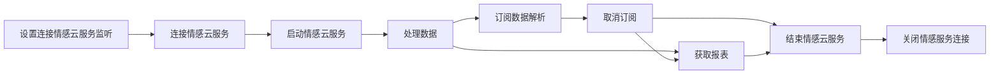

# 回车情感本地算法SDK说明文档

## 简介

将硬件获取到的脑电和心率原始数据传入情感SDK，获取实时分析数据和最终报表数据

## SDK组成

工程包含两个模块

*   硬件蓝牙SDK
*   情感算法SDK

## 硬件蓝牙SDK

### 说明

基础的Ble SDK可以方便从硬件端采集到原始脑波、心率等数据.

### 集成

#### gradle自动依赖

在项目根目录的build.gradle文件下添加以下依赖：

```groovy
repositories {
    mavenCentral()
}
```

在所需的module中的build.gradle文件下添加以下依赖：

    implementation 'cn.entertech.android:biomoduleble:1.5.5'

### 注意事项

并且需要申明蓝牙相关权限：

```xml
<uses-permission android:name="android.permission.BLUETOOTH"
    android:maxSdkVersion="30" />
<uses-permission android:name="android.permission.BLUETOOTH_ADMIN"
android:maxSdkVersion="30" />
<uses-permission android:name="android.permission.ACCESS_COARSE_LOCATION" android:maxSdkVersion="30" />
<uses-permission android:name="android.permission.ACCESS_FINE_LOCATION" android:maxSdkVersion="30" />
<uses-permission android:name="android.permission.BLUETOOTH_SCAN" />
<uses-permission android:name="android.permission.BLUETOOTH_CONNECT" />
```

### 使用

#### 1.连接设备

**代码示例**

```kotlin
var biomoduleBleManager = BiomoduleBleManager.getInstance(context)//传入application的context
//根据信号强弱连接最近的设备，如果需要连接指定设备可调用scanMacAndConnect方法传入mac地址连接
biomoduleBleManager.scanNearDeviceAndConnect(fun() {
    Log.d("扫描成功")
}, fun(e: Exception) {
    Log.d("扫描失败：$e")
}, fun(mac: String) {
    Log.d("连接成功$mac")
}) { msg ->
    Log.d("连接失败")
}
```

#### 2.添加数据监听

**代码示例**

```kotlin
//心率数据监听
var heartRateListener = fun(heartRate: Int) {
    Log.d(TAG,"心率数据" + heartRate)
}
biomoduleBleManager.addHeartRateListener(heartRateListener)
//原始脑波数据监听
var rawDataListener = fun(data:ByteArray){
    Log.d(TAG,Arrays.toString(data))
}
biomoduleBleManager.addRawDataListener(rawDataListener)
```

> 注意：如果在界面退出时需要调用对象的移除监听方法，否则会出现内存溢出，如biomoduleBleManager.removeRawDataListener(rawDataListener)

#### 3.采集脑波和心率数据

**代码示例**

```kotlin
//如果想要停止采集调用stopBrainCollection()
biomoduleBleManager.startBrainCollection()
```

更多详细的蓝牙ble方法可以参考[Ble详细API说明](https://github.com/Entertech/Enter-Biomodule-BLE-Android-SDK/blob/master/Ble详细API说明.md)

## 情感离线算法SDK

### 说明

将硬件端采集到的脑电和心率原始数据传入情感离线算法SDK，可以计算出实时分析值和最终报表值。

### 集成

#### 本地依赖

将Demo中app/libs目录下的affective-offline-sdk-1.0.7.aar文件和app/src/main/jniLibs目录下对应平台的so文件拷入自己的工程中

#### gradle自动依赖

在项目根目录的build.gradle文件下添加以下依赖：

```groovy
repositories {
    mavenCentral()
}
```

在所需的module中的build.gradle文件下添加以下依赖：

    implementation 'cn.entertech.android:affective-offline-sdk:1.0.7'

### 使用

#### 获取本地情感云服务

```kotlin
IAffectiveDataAnalysisService.getService(AffectiveServiceWay.AffectiveLocalService)

```

#### 连接情感云服务

     IAffectiveDataAnalysisService.connectAffectiveServiceConnection(
    			IConnectionServiceListener,
    			//以默认值就行
                EnterAffectiveConfigProxy
            )

    interface IConnectionServiceListener {
        /**
         * 连接成功 
         * @param sessionId sessionId
         * */
        fun connectionSuccess(sessionId:String?)

        /**
         * 连接失败
         * */
        fun connectionError(error: Error?)
    }

#### **授权文件获取与使用**

##### **获取**

用户点击[管理后台](https://admin.affectivecloud.cn/#/offline_applications/offline_app_manager)\[下载授权文件]按钮，服务端创建一个授权文件。其中包含用户的授权信息，例如用户ID、授权日期、授权期限、授权算法等，并对这个文件进行私钥签名。

##### **使用**

###### 若授权文件放在工程res/raw文件夹

    private val authenticationInputStream: InputStream? by lazy {
            resources.openRawResource(R.raw.check)
        }

###### 若授权文件放在工程res/assets文件夹

     private val authenticationInputStream: InputStream? by lazy {
            resources.assets.open(fileName)
        }

###### 若授权文件放在工程其他目录下

     private val authenticationInputStream: InputStream? by lazy {
            FileInputStream(File)
        } 

#### 启动情感云服务

    IAffectiveDataAnalysisService.startAffectiveService(
                        authenticationInputStream,
                        Context, IStartAffectiveServiceLister
                    )

    interface IStartAffectiveServiceLister {
        /**
         * 启动成功
         * */
        fun startSuccess()

        /**
         * 启动生物基础服务失败
         * */
        fun startBioFail(error: Error?)

        /**
         * 启动生理基础服务失败
         * */
        fun startAffectionFail(error: Error?)

        /**
         * 启动失败
         * */
        fun startFail(error: Error?)
    }

#### 订阅数据回调

    IAffectiveDataAnalysisService.subscribeData(
    		//生物基础数据
            bdListener: ((RealtimeBioData?) -> Unit)? = null,
    		//生理数据
            listener: ((RealtimeAffectiveData?) -> Unit)? = null
        )

#### 取消订阅数据回调

     /**
         * 取消订阅
         * */
        IAffectiveDataAnalysisService.unSubscribeData(
            bdListener: ((RealtimeBioData?) -> Unit)? = null,
            listener: ((RealtimeAffectiveData?) -> Unit)? = null
        )

#### 重启情感云服务

      /**
         * 重启情感服务
         * */
        IAffectiveDataAnalysisService.restoreAffectiveService(listener: IStartAffectiveServiceLister)

#### 结束情感云服务

       IAffectiveDataAnalysisService.finishAffectiveService(listener: IFinishAffectiveServiceListener)

#### 分析本地文件数据

       /**
         * @param inputStream 待分析的数据流
         * @param callback 结果回调
         * @param appSingleData 处理单个数据，若返回true，则表示消耗该数据，不添加到all数据里面
         * @param case 数据流读取出来的字符串转成需要的类型R
         * @param appendAllData 处理所有未被消耗的数据
         * */
        fun <R> readFileAnalysisData(inputStream: InputStream,
                                     appSingleData: ((R) -> Boolean)? = null,
                                     appendAllData: (List<R>) -> Unit,
                                     case: (String) -> R,
                                     callback: Callback,
        )

#### 处理数据

```
	/**
     * 发送数据
     * */

    fun appendEEGData(brainData: ByteArray)

    /**
     * 单通道数据
     * */
    fun appendSCEEGData(brainData: ByteArray)

    /**
     * 添加心率数据
     * */
    fun appendHeartRateData(heartRateData: Int)


    /**
     * 坐垫数据
     * */
    fun appendPEPRData(peprData: ByteArray)


```

#### 添加服务连接状态监听

    fun addServiceConnectStatueListener(
        connectionListener: () -> Unit,
        disconnectListener: (String) -> Unit
    )

#### 移除服务连接状态监听

    fun removeServiceConnectStatueListener(
        connectionListener: () -> Unit,
        disconnectListener: (String) -> Unit
    )

#### 当前情感云服务是否启动

    fun hasConnectAffectiveService(): Boolean

#### 当前情感云服务是否连接

    fun hasConnectAffectiveService(): Boolean

#### 关闭情感云服务连接

```kotlin
    /**
 * 断开
 * */
fun closeAffectiveServiceConnection()
```

#### 获取报表

    /**
     * 获取报表
     * @param needFinishService 是否需要自动结束情感服务 true 自动结束
     * */
    fun getReport(listener: IGetReportListener, needFinishService: Boolean)

    /**
     * 获取报表接口
     * */
    interface IGetReportListener {

        /**
         * 获取报表出错
         * */
        fun onError(error: Error?)


        /**
         * 获取报表成功
         * */
        fun onSuccess(entity: UploadReportEntity?)

        /**
         * 获取生物基础数据报表出错
         * */
        fun getBioReportError(error: Error?)


        /**
         * 获取生理状态分析数据报表出错
         * */
        fun getAffectiveReportError(error: Error?)
    }

**实时生物基础数据字段说明**

```kotlin


data class RealtimeBioData(
    var realtimeEEGData: RealtimeEEGData? = null,
    var realtimeHrData: RealtimeHrData? = null,
    var realtimeMCEEGData: RealtimeMCEEGData? = null,
    var realtimeSCEEGData: RealtimeSCEEGData?=null,
    var realtimeBCGData: RealtimeBCGData? = null,
    var realtimePEPRData: RealtimePEPRData? = null,
    var realtimeDceegSsvepData: RealtimeDceegSsvepData? = null
)

data class RealtimeSCEEGData(
    /**
     * 经过滤波后的通道实时脑电波，一个数组，长度为150，对应0.6秒内的脑电波形；
     * 数值范围[-500, 500]，信号质量不佳时全为0
     * */
    val sceegWave: List<Double> = emptyList(),
    //5种脑电波节律的能量分贝值：α波、β波、θ波、δ波、γ波
    //5种脑电波节律各一个数值，数值范围[0, +∞)，初始阶段与信号质量不佳时返回为0
    val sceegAlphaPower: Double = 0.0,
    val sceegBetaPower: Double = 0.0,
    val sceegThetaPower: Double = 0.0,
    val sceegDeltaPower: Double = 0.0,
    val sceegGammaPower: Double = 0.0,
    /**
     * 脑电信号质量等级
     * 大于1表示脑电信号质量良好
     * */
    val sceegQuality: Double = 0.0,
)


class RealtimeEEGData {
    /**
     * 经过滤波后的左通道实时脑电波，左右通道各一个数组，长度为150，对应0.6秒内的脑电波形；数值范围[-500, 500]，信号质量不佳时全为0
     * */
    var leftwave: ArrayList<Double>? = null

    /**
     * 经过滤波后的右通道实时脑电波，左右通道各一个数组，长度为150，对应0.6秒内的脑电波形；数值范围[-500, 500]，信号质量不佳时全为0
     * */
    var rightwave: ArrayList<Double>? = null

    //5种脑电波节律的能量分贝值：α波、β波、θ波、δ波、γ波
    // 5种脑电波节律各一个数值，数值范围[0, +∞)，初始阶段与信号质量不佳时返回为0

    var alphaPower: Double? = null
    var betaPower: Double? = null
    var thetaPower: Double? = null
    var deltaPower: Double? = null
    var gammaPower: Double? = null

    /**
     * 脑电信号质量等级 >=1表示脑电信号质量良好
     * */
    var quality: Double? = null

    override fun toString(): String {
        return "RealtimeEEGDataEntity(leftwave=$leftwave, rightwave=$rightwave, alphaPower=$alphaPower, betaPower=$betaPower, thetaPower=$thetaPower, deltaPower=$deltaPower, gammaPower=$gammaPower, quality=$quality)"
    }

}

data class RealtimeHrData(
    /**
     * 实时心率值,数值范围[0, 255]，单位：BPM
     * */
    @SerializedName("hr") var hr: Double? = null,
    /**
     * 实时心率变异性，数值范围[0, +∞)
     * */
    @SerializedName("hrv") var hrv: Double? = null
) {
    override fun toString(): String {
        return "RealtimeHrData(hr=$hr, hrv=$hrv)"
    }
}

class RealtimePEPRData {
    //脉搏波
    var bcgWave: ArrayList<Double>? = null
    //呼吸波
    var rwWave: ArrayList<Double>? = null
    //脉搏波质量等级。 0：表示未佩戴；1：有数据没信号；2：有数据信号良好
    var bcgQuality: Int? = null
    //呼吸波质量等级。 0：表示未佩戴；1：有数据没信号；2：有数据信号良好
    var rwQuality: Int? = null
    //心率值 单位：BPM
    var hr: Double? = null
    //心率变异性值 单位：毫秒
    var hrv: Double? = null
    //呼吸率
    var rr:Double? = null
}

```

**实时**生理状态**基础数据字段说明**

```kotlin


class RealtimeAffectiveData(
        /**
         * 实时注意力数据
         * */
        var realtimeAttentionData: RealtimeAttentionData? = null,
        /**
         * 实时放松度数据
         * */
        var realtimeRelaxationData: RealtimeRelaxationData? = null,
        /**
         * 实时压力水平数据
         * */
        var realtimePressureData: RealtimePressureData? = null,
        /**
         * 实时愉悦度数据
         * */
        var realtimePleasureData: RealtimePleasureData? = null,
        /**
         * 实时激活度数据
         * */
        var realtimeArousalData: RealtimeArousalData? = null,
        /**
         * 实时睡眠数据
         * */
        var realtimeSleepData: RealtimeSleepData? = null,
        /**
         * 实时和谐度数据
         * */
        var realtimeCoherenceData: RealtimeCoherenceData? = null,
        var realtimeSsvepMultiClassifyData: RealtimeSsvepMultiClassifyData? = null,
        /**
         * 实时智慧数据
         * */
        var realtimeFlowData: RealtimeFlowData? = null
) {

    override fun toString(): String {
        return "RealtimeAffectiveData(realtimeAttentionData=$realtimeAttentionData, realtimeRelaxationData=$realtimeRelaxationData, realtimePressureData=$realtimePressureData, realtimePleasureData=$realtimePleasureData, realtimeArousalData=$realtimeArousalData, realtimeSleepData=$realtimeSleepData, realtimeCoherenceData=$realtimeCoherenceData, realtimeSsvepMultiClassifyData=$realtimeSsvepMultiClassifyData, realtimeFlowData=$realtimeFlowData)"
    }
}

data class RealtimeSleepData(
        /**
         * 实时睡眠程度,该值越小表示睡眠越深；该值越大表示越接近清醒
         * 实时计算的睡眠程度未经过总体校正，因此在清醒、浅睡与深睡之间没有固定的界限划分，但睡眠程度的相对变化仍可实时反映睡眠状态倾向）
         * 数值范围[0, 100],初始化阶段该值为0，初始化完成后的值有效
         * */
        @SerializedName("sleepDegree") var sleepDegree: Double? = null,
        /**
         * 实时睡眠状态判断,可用于控制其他设备在入睡后切换状态
         * 数值范围{0, 1}；未睡着之前为0，入睡后保持为1；数组中数值范围[-500, 500]，信号质量不佳时全为0
         * */
        @SerializedName("sleepState") var sleepState: Double? = null
) {

    override fun toString(): String {
        return "RealtimeSleepData(sleepDegree=$sleepDegree, sleepState=$sleepState)"
    }
}


```

**报表字段说明**

```kotlin


data class UploadReportEntity(
        val code: Int,

        val `data`: Data? = null,
        val msg: String,


        val reportVersion: String = "3",

        var sessionId: String,
        var start: String,

        var timePoints: TimePoints? = null,
        val user_id: Int,
        /**
         * 算法版本
         * */
        val version: Version,
        )

data class Data(
        val affective: Affective,
        val biodata: Biodata
)

data class TimePoints(
        val affective: AffectiveTimePoints,
        val biodata: BiodataTimePoints
)

data class Version(
        val affective: AffectiveVersion,
        val biodata: BiodataVersion
)

data class Affective(
        val arousal: Arousal,
        val attention: Attention,
        val coherence: Coherence,
        val pleasure: Pleasure,
        val pressure: Pressure,
        val relaxation: Relaxation,
        val meditation: Meditation
)

data class Biodata(
        val eeg: Eeg,

        val hr: HrV2,
        val pepr: PEPR?
)

data class PEPR(
        val hrAvg: Int,
        val hrMax: Int,
        val hrMin: Int,
        val hrRec: List<Int>,

        val hrvAvg: Double,

        val hrvRec: List<Double>,

        val rrAvg: Double,

        val rrRec: List<Double>,

        val bcgQualityRec: List<Int>,

        val rwQualityRec: List<Int>
)


data class Arousal(
        /**
         * 全程激活度有效值（除去无效值0）的均值
         * */
        val arousal_avg: Int,
        /**
         * 全程激活度记录
         * */
        val arousal_rec: Any
)

data class Attention(
        /**
         * 全程注意力有效值（除去无效值0）的均值
         * */

        val attentionAvg: Double,
        /**
         * 全程注意力记录
         * */

        val attentionRec: List<Double>
)

data class Coherence(
        /**
         * 全程和谐度有效值（除去无效值0）的均值
         * */

        val coherenceAvg: Double,

        val coherenceDuration: Int?,

        val coherenceFlag: List<Int>?,
        /**
         * 全程和谐度记录
         * */

        val coherenceRec: List<Double>
)

data class Pleasure(
        /**
         * 全程愉悦度有效值（除去无效值0）的均值
         * */

        val pleasureAvg: Double,
        /**
         * 全程压力水平记录
         * */

        val pleasureRec: List<Double>
)

data class Pressure(

        val pressureAvg: Double,

        val pressureRec: List<Double>
)

data class Relaxation(
        /**
         * 全程放松度有效值（除去无效值0）的均值
         * */

        val relaxationAvg: Double,
        /**
         * 全程放松度记录
         * */

        val relaxationRec: List<Double>
)

data class Meditation(

        val meditationAvg: Double,

        val meditationRec: List<Double>,

        val meditationTipsRec: List<Int>,

        val flowPercent: Double,

        val flowDuration: Int,

        val flowLatency: Int,

        val flowCombo: Int,

        val flowDepth: Double,

        val flowBackNum: Int,

        val flowLossNum: Int,
        )

data class Eeg(

        val eegAlphaCurve: List<Double>,

        val eegBetaCurve: List<Double>,

        val eegDeltaCurve: List<Double>,

        val eegGammaCurve: List<Double>,

        val eegThetaCurve: List<Double>,

        val eegQualityRec: List<Int>
)

data class HrV2(

        val hrAvg: Double?,

        val hrMax: Int?,

        val hrMin: Int?,

        val hrRec: List<Int>,

        val hrvAvg: Double?,

        val hrvRec: List<Double>
)

data class AffectiveTimePoints(
        val arousal: List<TimePoint>,
        val attention: List<TimePoint>,
        val coherence: List<TimePoint>,
        val pleasure: List<TimePoint>,
        val pressure: List<TimePoint>,
        val relaxation: List<TimePoint>,
        val meditation: List<TimePoint>
)

data class BiodataTimePoints(
        val eeg: List<TimePoint>,

        val hr: List<TimePoint>,
        val pepr: List<TimePoint>
)

data class AffectiveVersion(
        val arousal: String,
        val attention: String,
        val coherence: String,
        val pleasure: String,
        val pressure: String,
        val relaxation: String
)

data class BiodataVersion(
        val eeg: String,

        val hr: String,
        val pepr: String
)

/**
 * 持续的时间段，可能中途会断开
 * */
data class TimePoint(
        var start: String,
        var stop: String
)


```

#### 辅助功能

**调式日志**

如果调试阶段需要打印日志调用如下方法：

```kotlin
AffectiveLogHelper.printer=object :ILogPrinter{
    override fun d(tag: String, msg: String) {
    }

    override fun i(tag: String, msg: String) {
    }

    override fun e(tag: String, msg: String) {
    }
}
```

内部默认使用DefaultLogPrinter

    object DefaultLogPrinter:ILogPrinter {
        override fun d(tag: String, msg: String) {
            Log.d(tag, msg)
        }

        override fun i(tag: String, msg: String) {
            Log.i(tag, msg)
        }

        override fun e(tag: String, msg: String) {
            Log.e(tag, msg)
        }
    }

### 流程图



