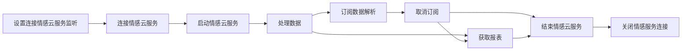

# 回车情感离线算法SDK说明文档

## 情感离线算法SDK

### 说明

将硬件端采集到的脑电和心率原始数据传入情感离线算法SDK，可以计算出实时分析值和最终报表值。

在开始开发前，你需要联系管理员注册好测试应用。确定好你的应用中所**需要的服务**，然后在[管理后台](https://admin.affectivecloud.cn/#/offline_applications/offline_app_manager)\[下载授权文件]，然后再进行开发。

### 注意事项

#### 代码混淆

    -keep class cn.entertech.affectivesdk.authentication.bean.** { *; }

#### so 文件说明

算法核心功能实现依赖 so 库。在使用 SDK ，以及向工程中添加 so 时请注意以下几点：

##### 确保添加了正确的 so 库文件

###### **何为正确的 so 文件？**

官方发布新版 SDK 时一般会同时更新 jar/aar 文件和 so 文件，您需要做的是更新这些文件到您的工程中，不要出现遗漏。您可以参考Eclipse、Android Studio 配置工程提到的添加方法进行操作。

##### 确保添加的 so 库文件与平台匹配

###### **何为正确的 so 文件与平台匹配？**

arm与x86，这代表核心处理器（cpu）的两种架构，对不同的架构需要引用不同的 so 文件，如果引用出现错误是不能正常使用 SDK 的。

解决这个问题最简单的办法是在 libs 或 jnilibs 文件夹下只保留 arm64-v8a 一个文件夹。

### 集成

#### 本地依赖

将Demo中app/libs目录下的affective-offline-sdk-1.1.2.aar文件和app/src/main/jniLibs目录下对应平台架构的so文件拷入自己的工程中

#### gradle自动依赖

在项目根目录的build.gradle文件下添加以下依赖：

```groovy
repositories {
    mavenCentral()
}
```

在所需的module中的build.gradle文件下添加以下依赖：

    implementation 'cn.entertech.android:affective-offline-sdk:1.1.2'

### 使用

#### 获取离线计算服务

```kotlin
IAffectiveDataAnalysisService.getService(AffectiveServiceWay.AffectiveLocalService)

```

#### 连接离线计算服务

     IAffectiveDataAnalysisService.connectAffectiveServiceConnection(
    			IConnectionServiceListener,
    			//以默认值就行
                EnterAffectiveConfigProxy
            )

    interface IConnectionServiceListener {
        /**
         * 连接成功 
         * @param sessionId sessionId
         * */
        fun connectionSuccess(sessionId:String?)

        /**
         * 连接失败
         * */
        fun connectionError(error: Error?)
    }

#### **授权文件获取与使用**

##### **获取**

用户点击[管理后台](https://admin.affectivecloud.cn/#/offline_applications/offline_app_manager)\[下载授权文件]按钮，服务端创建一个授权文件。其中包含用户的授权信息，例如用户ID、授权日期、授权期限、授权算法等，并对这个文件进行私钥签名。

##### **使用**

###### 若授权文件放在工程res/raw文件夹

    private val authenticationInputStream: InputStream? by lazy {
            resources.openRawResource(R.raw.check)
        }

###### 若授权文件放在工程res/assets文件夹

     private val authenticationInputStream: InputStream? by lazy {
            resources.assets.open(fileName)
        }

###### 若授权文件放在工程其他目录下

     private val authenticationInputStream: InputStream? by lazy {
            FileInputStream(File)
        } 

#### 启动离线计算服务

    IAffectiveDataAnalysisService.startAffectiveService(
                        authenticationInputStream,
                        Context, IStartAffectiveServiceLister

)

    interface IStartAffectiveServiceLister {
        /**
         * 启动成功
         * */
        fun startSuccess()

        /**
         * 启动生物基础服务失败
         * */
        fun startBioFail(error: Error?)

        /**
         * 启动生理基础服务失败
         * */
        fun startAffectionFail(error: Error?)

        /**
         * 启动失败
         * */
        fun startFail(error: Error?)
    }

#### 订阅数据回调

实时数据字段说明详见：[基础数据字段说明](https://github.com/Entertech/Enter-Affective-Offline-SDK/blob/main/%E5%AE%9E%E6%97%B6%E7%94%9F%E7%89%A9%E5%9F%BA%E7%A1%80%E6%95%B0%E6%8D%AE%E5%AD%97%E6%AE%B5%E8%AF%B4%E6%98%8E.md),[情感数据字段说明](https://github.com/Entertech/Enter-Affective-Offline-SDK/blob/main/%E5%AE%9E%E6%97%B6%E7%94%9F%E7%90%86%E7%8A%B6%E6%80%81%E5%9F%BA%E7%A1%80%E6%95%B0%E6%8D%AE%E5%AD%97%E6%AE%B5%E8%AF%B4%E6%98%8E.md)

    IAffectiveDataAnalysisService.subscribeData(
    		//生物基础数据
            bdListener: ((RealtimeBioData?) -> Unit)? = null,
    		//生理数据
            listener: ((RealtimeAffectiveData?) -> Unit)? = null
        )

#### 取消订阅数据回调

     /**
         * 取消订阅
         * */
        IAffectiveDataAnalysisService.unSubscribeData(
            bdListener: ((RealtimeBioData?) -> Unit)? = null,
            listener: ((RealtimeAffectiveData?) -> Unit)? = null
        )

#### 重启离线计算服务

      /**
         * 重启离线计算服务
         * */
        IAffectiveDataAnalysisService.restoreAffectiveService(listener: IStartAffectiveServiceLister)

#### 结束离线计算服务

       IAffectiveDataAnalysisService.finishAffectiveService(listener: IFinishAffectiveServiceListener)

#### 分析本地文件数据

       /**
         * @param inputStream 待分析的数据流
         * @param callback 结果回调
         * @param appSingleData 处理单个数据，若返回true，则表示消耗该数据，不添加到all数据里面
         * @param case 数据流读取出来的字符串转成需要的类型R
         * @param appendAllData 处理所有未被消耗的数据
         * */
        fun <R> readFileAnalysisData(inputStream: InputStream,
                                     appSingleData: ((R) -> Boolean)? = null,
                                     appendAllData: (List<R>) -> Unit,
                                     case: (String) -> R,
                                     callback: Callback,
        )

#### 处理数据

```
	/**
     * 发送数据
     * */

    fun appendEEGData(brainData: ByteArray)

    /**
     * 单通道数据
     * */
    fun appendSCEEGData(brainData: ByteArray)

    /**
     * 添加心率数据
     * */
    fun appendHeartRateData(heartRateData: Int)


    /**
     * 坐垫数据
     * */
    fun appendPEPRData(peprData: ByteArray)


```

#### 添加服务连接状态监听

    fun addServiceConnectStatueListener(
        connectionListener: () -> Unit,
        disconnectListener: (String) -> Unit
    )

#### 移除服务连接状态监听

    fun removeServiceConnectStatueListener(
        connectionListener: () -> Unit,
        disconnectListener: (String) -> Unit
    )

#### 当前离线计算服务是否启动

    fun hasConnectAffectiveService(): Boolean

#### 当前离线计算服务是否连接

    fun hasConnectAffectiveService(): Boolean

#### 关闭离线计算服务连接

```kotlin
    /**
 * 断开
 * */
fun closeAffectiveServiceConnection()
```

#### 获取报表

相应返回的 report 字段，具体字段的详细描述见[报表数据字段详情](https://github.com/Entertech/Enter-Affective-Offline-SDK/blob/main/%E6%8A%A5%E8%A1%A8%E6%95%B0%E6%8D%AE%E5%AD%97%E6%AE%B5%E8%AF%B4%E6%98%8E.md)。

    /**
     * 获取报表
     * @param needFinishService 是否需要自动结束离线计算服务 true 自动结束
     * */
    fun getReport(listener: IGetReportListener, needFinishService: Boolean)

    /**
     * 获取报表接口
     * */
    interface IGetReportListener {

        /**
         * 获取报表出错
         * */
        fun onError(error: Error?)


        /**
         * 获取报表成功
         * */
        fun onSuccess(report: UploadReportEntity?)

        /**
         * 获取生物基础数据报表出错
         * */
        fun getBioReportError(error: Error?)


        /**
         * 获取生理状态分析数据报表出错
         * */
        fun getAffectiveReportError(error: Error?)
    }

#### 辅助功能

**调式日志**

如果调试阶段需要打印日志调用如下方法：

```kotlin
AffectiveLogHelper.printer=object :ILogPrinter{
    override fun d(tag: String, msg: String) {
    }

    override fun i(tag: String, msg: String) {
    }

    override fun e(tag: String, msg: String) {
    }
}
```

内部默认使用DefaultLogPrinter

    object DefaultLogPrinter:ILogPrinter {
        override fun d(tag: String, msg: String) {
            Log.d(tag, msg)
        }

        override fun i(tag: String, msg: String) {
            Log.i(tag, msg)
        }

        override fun e(tag: String, msg: String) {
            Log.e(tag, msg)
        }
    }

#### 流程图



### 常见问题

#### 运行demo 报 dlopen failed: library "libaffective.so" not found

使用adb命令查询目标设备或模拟器的架构

    adb shell getprop ro.product.cpu.abi

在项目application类型的组件下的gradle 中的android/defaultConfig添加下面配置代码。abi指的是目标设备或模拟器的架构。

    ndk {
                abiFilters abi
        }

