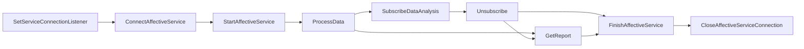

# Enter Affective Offline Algorithm SDK

Language: English | [简体中文](README.zh-CN.md)

## Affective Offline Algorithm SDK

### Overview

Pass raw EEG and heart rate data collected from the hardware device to the Affective Offline Algorithm SDK to calculate realtime analysis values and final report values.

Before development, contact the administrator to register a test application. Confirm the **services** required by your application, then download the authorization file from the [admin console](https://admin.affectivecloud.cn/#/offline_applications/offline_app_manager) and start development.

### Notes

#### Code Obfuscation

```proguard
-keep class cn.entertech.affectivesdk.authentication.bean.** { *; }
```

#### Shared Object Files

The core algorithm depends on `.so` libraries. Pay attention to the following points when using the SDK and adding `.so` files to your project.

##### Add the Correct `.so` Files

###### What are the correct `.so` files?

When an official SDK version is released, the `jar` file and `.so` files are always updated together. Update all of these files in your project and make sure none are missing. You can refer to the setup methods for Eclipse or Android Studio projects.

##### Match `.so` Files to the Platform

###### What does platform matching mean?

`arm` and `x86` represent two CPU architectures. Different architectures require different `.so` files. If the wrong files are referenced, the SDK cannot work correctly.

The simplest way to avoid this issue is to keep only the `arm64-v8a` directory under `libs` or `jniLibs`.

### Integration

```groovy
dependencies {
    def affectiveVersion = "1.3.4-svm-authentication"
    implementation "cn.entertech.android:affective_sdk_authentication_api:$affectiveVersion"
    implementation "cn.entertech.android:affective-offline-sdk-authentication:$affectiveVersion"
    implementation("org.bouncycastle:bcprov-jdk18on:1.76")
    implementation("org.bouncycastle:bcpkix-jdk18on:1.76")
}
```

The API dependency provides the public interfaces and data classes. The local AAR provides the offline SDK implementation and native libraries. After adding the dependencies, sync the Gradle project.

### Usage

#### Get the Offline Computing Service

```kotlin
IAffectiveDataAnalysisService.getService(AffectiveServiceWay.AffectiveLocalService)
// or
EnterAffectiveLocalService(): IAffectiveDataAnalysisService
```

#### Connect to the Offline Computing Service

```kotlin
IAffectiveDataAnalysisService.connectAffectiveServiceConnection(
    IConnectionServiceListener,
    // Use the default value.
    EnterAffectiveConfigProxy
)

interface IConnectionServiceListener {
    /**
     * Connection succeeded.
     * @param sessionId session ID
     */
    fun connectionSuccess(sessionId: String?)

    /**
     * Connection failed.
     */
    fun connectionError(error: Error?)
}
```

#### Authorization File

##### Get the Authorization File

Click **Download authorization file** in the [admin console](https://admin.affectivecloud.cn/#/offline_applications/offline_app_manager). The server creates an authorization file that contains authorization information such as user ID, authorization date, authorization period, and authorized algorithms, then signs the file with a private key.

##### Use the Authorization File

###### If the authorization file is in the project `res/raw` directory

```kotlin
private val authenticationInputStream: InputStream? by lazy {
    resources.openRawResource(R.raw.check)
}
```

###### If the authorization file is in the project `res/assets` directory

```kotlin
private val authenticationInputStream: InputStream? by lazy {
    resources.assets.open(fileName)
}
```

###### If the authorization file is in another project directory

```kotlin
private val authenticationInputStream: InputStream? by lazy {
    FileInputStream(File)
}
```

#### Start the Offline Computing Service

```kotlin
IAffectiveDataAnalysisService.startAffectiveService(
    authenticationInputStream,
    Context,
    IStartAffectiveServiceLister
)
```

```kotlin
interface IStartAffectiveServiceLister {
    /**
     * Started successfully.
     */
    fun startSuccess() {
    }

    /**
     * Failed to start the bio basic service.
     */
    fun startBioFail(error: Error?) {
    }

    /**
     * Failed to start the affective basic service.
     */
    fun startAffectionFail(error: Error?) {
    }

    /**
     * Failed to start.
     */
    fun startFail(error: Error?) {
    }

    /**
     * Already started.
     */
    fun hasStarted() {
    }
}
```

#### Subscribe to Data Callbacks

For realtime data field descriptions, see [Realtime Bio Basic Data Fields](realtime-bio-data-fields.md) and [Realtime Affective Basic Data Fields](realtime-affective-data-fields.md).

```kotlin
IAffectiveDataAnalysisService.subscribeData(
    // Bio basic data.
    bdListener: ((RealtimeBioData?) -> Unit)? = null,
    // Affective data.
    listener: ((RealtimeAffectiveData?) -> Unit)? = null
)
```

#### Unsubscribe from Data Callbacks

```kotlin
/**
 * Unsubscribe.
 */
IAffectiveDataAnalysisService.unSubscribeData(
    bdListener: ((RealtimeBioData?) -> Unit)? = null,
    listener: ((RealtimeAffectiveData?) -> Unit)? = null
)
```

#### Restart the Offline Computing Service

```kotlin
/**
 * Restart the offline computing service.
 */
IAffectiveDataAnalysisService.restoreAffectiveService(listener: IStartAffectiveServiceLister)
```

#### Finish the Offline Computing Service

```kotlin
IAffectiveDataAnalysisService.finishAffectiveService(listener: IFinishAffectiveServiceListener)

IAffectiveDataAnalysisService.suspendFinishAffectiveService()
```

#### Analyze Local File Data

```kotlin
/**
 * @param inputStream data stream to analyze
 * @param callback result callback
 * @param appSingleData handles a single data item. If true is returned, this data item is consumed and not added to all data.
 * @param case converts each string read from the data stream to the required type R
 * @param appendAllData handles all unconsumed data
 */
fun <R> readFileAnalysisData(
    inputStream: InputStream,
    appSingleData: ((R) -> Boolean)? = null,
    appendAllData: (List<R>) -> Unit,
    case: (String) -> R,
    callback: Callback,
)
```

#### Process Data

```kotlin
/**
 * Send EEG data.
 * isEar indicates whether the data is ear canal data.
 */
fun appendEEGData(brainData: ByteArray, isEar: Boolean = false)
fun appendEEGData(brainData: Int, isEar: Boolean = false)
fun appendEEGData(brainData: List<Int>, isEar: Boolean = false)

/**
 * Single-channel data.
 * isEar indicates whether the data is ear canal data.
 */
fun appendSCEEGData(brainData: ByteArray, isEar: Boolean = false)
fun appendSCEEGData(brainData: Int, isEar: Boolean = false)
fun appendSCEEGData(brainData: List<Int>, isEar: Boolean = false)

/**
 * Add heart rate data.
 */
fun appendHeartRateData(heartRateData: Int)

/**
 * PEPR data.
 */
fun appendPEPRData(peprData: ByteArray)
```

#### Add a Service Connection Status Listener

```kotlin
fun addServiceConnectStatueListener(
    connectionListener: () -> Unit,
    disconnectListener: (String) -> Unit
)
```

#### Remove a Service Connection Status Listener

```kotlin
fun removeServiceConnectStatueListener(
    connectionListener: () -> Unit,
    disconnectListener: (String) -> Unit
)
```

#### Check Whether the Offline Computing Service Has Started

```kotlin
fun hasConnectAffectiveService(): Boolean
```

#### Check Whether the Offline Computing Service Is Connected

```kotlin
fun hasConnectAffectiveService(): Boolean
```

#### Close the Offline Computing Service Connection

```kotlin
/**
 * Disconnect.
 */
fun closeAffectiveServiceConnection()
```

#### Get a Report

For details about the returned `report` fields, see [Report Data Fields](report-data-fields.md).

```kotlin
/**
 * Get a report.
 * @param needFinishService whether to automatically finish the offline computing service. true means finish automatically.
 */
fun getReport(listener: IGetReportListener, needFinishService: Boolean)

/**
 * Report callback interface.
 */
interface IGetReportListener {
    /**
     * Failed to get the report.
     */
    fun onError(error: Error?)

    /**
     * Report retrieved successfully.
     */
    fun onSuccess(report: UploadReportEntity?)

    /**
     * Failed to get the bio basic data report.
     */
    fun getBioReportError(error: Error?)

    /**
     * Failed to get the affective state analysis data report.
     */
    fun getAffectiveReportError(error: Error?)
}
```

Coroutine support:

```kotlin
suspend fun suspendGetReport(needFinishService: Boolean): UploadReportEntity?
```

##### Convert Brainwave Data to Percentages

```kotlin
BioDataUtils.brainwave2Rate(
    alpha: Double,
    beta: Double,
    gamma: Double,
    delta: Double,
    theta: Double,
    brainwaveRate: (
        Double,
        Double,
        Double,
        Double,
        Double
    ) -> Unit
)
```

| Parameter | Type | Description |
|:--:|:--:|:--:|
| alpha | Double |  |
| beta | Double |  |
| gamma | Double |  |
| delta | Double |  |
| theta | Double |  |
| brainwaveRate | (Double, Double, Double, Double, Double) -> Unit | Returns the alpha, beta, gamma, delta, and theta ratios as decimals. |

#### Flowchart


```mermaid
graph LR

SetServiceConnectionListener-->
ConnectAffectiveService-->
StartAffectiveService-->ProcessData
ProcessData-->GetReport
ProcessData-->SubscribeDataAnalysis
SubscribeDataAnalysis-->Unsubscribe
Unsubscribe-->FinishAffectiveService
Unsubscribe-->GetReport
GetReport-->FinishAffectiveService-->
CloseAffectiveServiceConnection
```

#### Utilities

##### Debug Logs

Call the following method to print logs during debugging:

```kotlin
AffectiveLogHelper.printer = object : ILogPrinter {
    override fun d(tag: String, msg: String) {
    }

    override fun i(tag: String, msg: String) {
    }

    override fun e(tag: String, msg: String) {
    }
}
```

The SDK uses `DefaultLogPrinter` internally by default.

```kotlin
object DefaultLogPrinter: ILogPrinter {
    override fun d(tag: String, msg: String) {
        Log.d(tag, msg)
    }

    override fun i(tag: String, msg: String) {
        Log.i(tag, msg)
    }

    override fun e(tag: String, msg: String) {
        Log.e(tag, msg)
    }
}
```

##### Serial Single-Channel Data Processing (Sceeg)

###### Raw Data Packet Structure

| Header | Packet Length | Detachment Detection Data | First Data | Second Data | Third Data | Fourth Data | Fifth Data | Checksum (single-byte contrast check) | Tail |
|:--|:--|:--|:--|:--|:--|:--|:--|:--|:--|
| 3 bytes | 1 byte | 1 byte | 3 bytes | 3 bytes | 3 bytes | 3 bytes | 3 bytes | 1 byte | 3 bytes |
| 0xBB-0xBB-0xBB | 0x18 | 0x00 (0 means worn normally; non-0 means detached) | 00-01-02 | 03-04-05 | 06-07-08 | 09-0A-0B | 0C-0D-0E | 0x77 | 0xEE-0xEE-0xEE |

###### Parse Complete Single-Channel Data

```kotlin
SingleChannelEEGUtil.process(byteInt: Int, appendDataList: (List<Int>) -> Unit)
```

| Parameter | Type | Description |
|:--:|:--:|:--:|
| byteInt | Int | Byte converted to an int value from 0 to 255. You can convert it with `CharUtil.converUnchart`. |
| appendDataList | (List\<Int>) -> Unit | Handles one valid single-channel data item. |

###### Parse and Append Single-Channel (Sceeg) Data to the Algorithm

```kotlin
SingleChannelEEGUtil.process(byteInt) { sceegData ->
    affectiveService?.appendSCEEGData(sceegData)
}
```

### FAQ

#### The demo reports `dlopen failed: library "libaffective.so" not found`

Use the following adb command to query the architecture of the target device or emulator:

```shell
adb shell getprop ro.product.cpu.abi
```

Add the following configuration to `android/defaultConfig` in the Gradle file of the project application component. `abi` is the architecture of the target device or emulator.

```groovy
ndk {
    abiFilters abi
}
```
